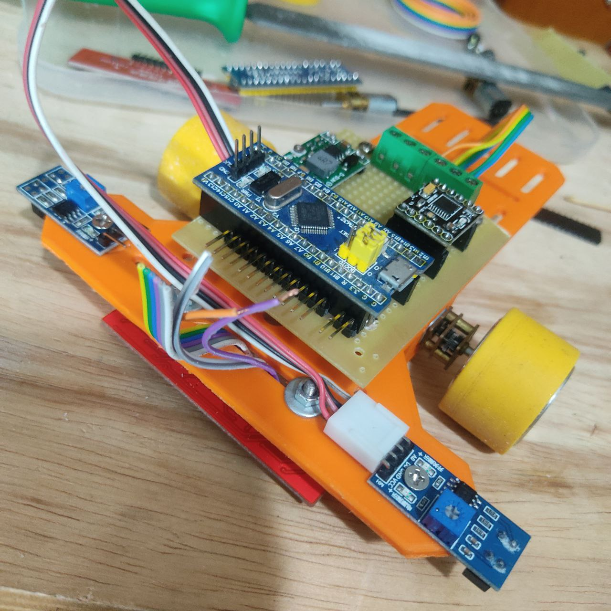
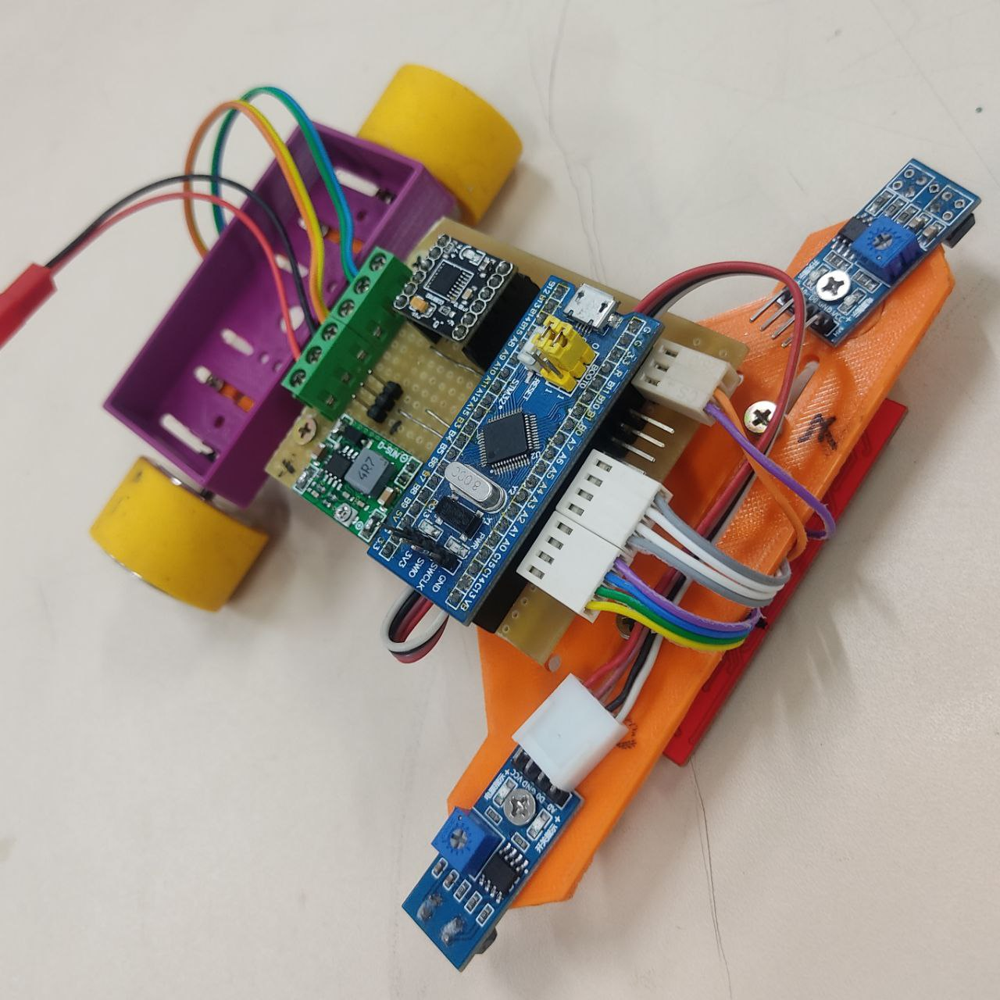
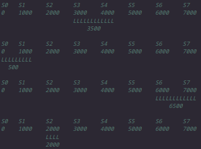

# followLine_doppler
Robô seguidor de linha doppler  utilizado na competição "RMS CHALLENGE" 04/21-23 de 2022

Ele faz uso de um mico controlador stm32f103x na plataforma de desenvolvimento *"bluepill"*. NO  desenvolvimento da firmware foi utilizado o C e o Sistema operacional em tempo real FreeRTOS.

Ela é composta por alguns arquivos importante para a lógica de funcionamento do robô:

 

[hardware.h](/firmware/include/hardware.h) Onde são definidos os pinos utilizados, como GPIOs, ADCs etc... 

 

[config.h](/firmware/include/config.h) Onde estão configurações globais, como Kp Ki e Kd dos PIDs, valores de cortes das leituras dos ADCs e temporizadores utilizados.

 

[pid.h](/firmware/lib/core/FreeRTOS/utility/pid.h) e [pid.c](/firmware/lib/core/FreeRTOS/utility/pid.c), biblioteca para processar o PID, ela abstrai os cálculos do processo. 

 

[/motor.h](motor.h) e [/firmware/lib/motor/motor.c](/firmware/lib/motor/motor.c), biblioteca para controle dos motores para pontes H que operam de foram similar ou igual ao LM293D .

 

[main_app.c](/firmware/src/main_app.c) Onde a logica de controle ocorre.

## **Funcionamento**

O FreeRTOS é um sistema que opera na vase do tempo e cria treads/tasks para executar as tarefas da aplicação. no caso do robo está sendo utilizado apenas a task principal.

### **Base**

Para realizar as leituras dos sensores cujo o sinal é analógico é utilizado em conjunto o TIMER3, DMA  e os ADCs. Basicamente o sistema realiza aquisições cíclicas em uma taxa de 10kHz por canal, ou seja a cada 0.0001s é realizada a leitura de 8 canais.

As leituras são concluídas após o buffer de memoria alocado estiver cheio, cada canal possui 10 espaços, onde o DMA transfere os valores  lidos do canal para a memoria de forma sequencial. Isso deixa o ciclo completo de leitura dos senores ter 1kHz.

A pós a conclusão das leituras uma interrupção é chamada ( função `void acd1_vBufferDoneHandler(BaseType_t *const pxHigherPriorityTaskWoken)` ), e nela e tratado dodo os cálculos para controlar o robo, isso ocorre de forma cíclica.

 

### **Logica de Controle**

**`void main_vApp(void * pvParameters)`**: Onde é inicializado as variáveis e configurado os GPIOs e os periféricos utilizados nas leituras dos sensores e logica da firmware.

**`acd1_vBufferDoneHandler(BaseType_t *const pxHigherPriorityTaskWoken)`**: Onde ocorre as demais etapas do calculo e controle do robô, (NOTA: geralmente essas atividades não ocorrem em interrupções) esse processos são subdivididos em algumas etapas:
  * Limpar variáveis: "`void app_vCleanValues(void)`"
  * Tratamento do sinal: "`void app_vSignalTreatment(void)`"
  * Processamento onde o controle do robo e caculos do pid são executados: "`void app_vProcess(void)`"

**void app_vSignalTreatment(void)**: 

1. Após o DMA concluir o preenchimento do buffer, os dado são acumulados (somados) para cada canal respectivo. Iniciando o processo para calcular do valor médio lido por cada senor (meia móvel).

2. Termino do processo do calculo de media.

3. Transforma os valores lidos pelos sensores em posicionamento onde variam de 0 a 7000 e gradações aproximando se do conceito de uma régua como mostrado abaixo e cada led foto snivel do sensor de linha corresponde a um pondo de S0 a S7:

**void app_vProcess(void)**: (documentando, embora haja vários comentários no corpo dessa função )

### **Sobre a mecânica**

O chassi foi feito dessa forma opara permitir alterar a posição dos motores, pois isso afeta no controle do robô quando mais proximo dos pontos de apoio ( roda esférica ) menos força eles terão que fazer para controlar o seguidor, portando ele sera mais rápido assim tendo uma controlei PID mais instável, quando mais longe dos ponto de apoio terá efeito contrario.